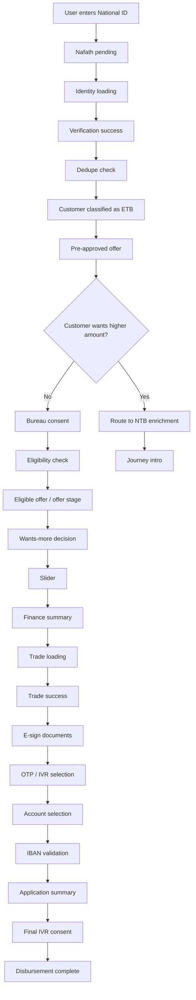
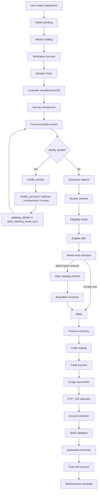

# RLOS Agentic Finance Agent — Project Summary

## Overview

This is a **Retail Loan Origination System (RLOS)** built as a conversational AI agent that guides customers through a complete loan application journey. The AI agent ("Raya") operates across voice and text channels, supports Arabic/English/Hindi, and covers 5 GCC/India regions (SA, UAE, IN, BH, KW) with full regulatory compliance.

> New to the project? Start with `CURRENT_RLOS_FLOW_WALKTHROUGH.md` for a step-by-step explanation of the current National ID flow from UI voice/text input through backend, agent state changes, widgets, and mocked data.

---

## Architecture

```
┌─────────────┐     SSE Stream      ┌─────────────┐     HTTP POST     ┌─────────────┐
│  Frontend   │◄────────────────────►│   Backend   │◄──────────────────►│    Agent    │
│  (Next.js)  │    /api/chat/route   │  (Gateway)  │    /invoke         │ (LangGraph) │
│  Port 3000  │                      │  Port 8000  │                    │  Port 8001  │
└─────────────┘                      └─────────────┘                    └──────┬──────┘
                                                                               │
                                                                    Temporal Signals
                                                                               │
                                                                        ┌──────▼──────┐
                                                                        │  Temporal   │
                                                                        │  Workflow   │
                                                                        │  Port 7233  │
                                                                        └──────┬──────┘
                                                                               │
                                                                    ┌──────────┼──────────┐
                                                                    ▼          ▼          ▼
                                                              Nafath API   SIMAH API  Core Banking
                                                              (mocked)     (mocked)   (mocked)
```

### Data Flow (single user message)

1. **Frontend** `useChat` → POST `/api/chat/route.ts` (Next.js proxy)
2. **Next.js route** → POST `backend:8000/api/chat`
3. **Backend** → POST `agent:8001/invoke` with session + messages
4. **Agent Node 1 (Classify)** → Deterministic regex OR GPT-4o-mini classification
5. **Agent Node 2 (Extract)** → `_advance_session_state()` + Temporal signals
6. **Agent Node 3 (Respond)** → Full GPT-4o-mini with dynamic system prompt
7. **Backend** → Resolves widget (if state transition) → SSE stream back
8. **Frontend** → Renders text + widget component

---

## Module-by-Module Breakdown

---

### 1. `docker-compose.yml` — Infrastructure Services

Defines the infrastructure backbone for the system.

| Service | Image | Port | Role |
|---------|-------|------|------|
| PostgreSQL 15 | `postgres:15` | 5432 | Temporal's persistence backend |
| Redis 7 | `redis:7-alpine` | 6379 | Session state store (designed for, not yet wired) |
| MongoDB 7 | `mongo:7` | 27017 | Conversation history store (designed for, not yet wired) |
| Temporal | `temporalio/auto-setup` | 7233, 8080 | Workflow orchestration engine |

All services share `rlos-network` bridge network with named volumes for data persistence.

---

### 2. `agent/` — LangGraph AI Agent (Port 8001)

**Purpose:** The AI brain of the system — a 3-node LangGraph pipeline that classifies intent, extracts data, and generates contextual responses using GPT-4o-mini.

**Technologies:** LangGraph, OpenAI GPT-4o-mini, Temporal SDK, FastAPI + Uvicorn

#### Key Files

| File | Role |
|------|------|
| `main.py` | FastAPI server with `/invoke` and `/conversation/{id}` endpoints. Manages in-memory session cache backed by file persistence. |
| `persistence.py` | JSON file-based session/conversation store under `.data/sessions` and `.data/conversations`. Sessions expire after 30 min TTL. |
| `graph/graph.py` | Defines the LangGraph `StateGraph`: `classify → extract → respond → END` |
| `graph/state.py` | `ConversationState` TypedDict: messages, session, last_response, extract, intent, classified_data, `wants_more` |
| `graph/nodes.py` | Three core nodes: classify_intent, extract_data, build_response |
| `prompts/master_prompt.py` | ~600-line system prompt defining Raya's persona, language rules, regional compliance, channel rules, and 5-step journey logic |
| `prompts/builder.py` | Assembles the full system prompt by combining master prompt + session context + sub-step instructions |
| `prompts/regulatory.py` | Region-to-regulator mapping (SAMA, CBUAE, RBI, CBB, CBK) |
| `prompts/step_goals.py` | Step goals and extraction schemas per region |
| `extractors/parser.py` | Parses `<extract>...</extract>` JSON blocks from LLM output |
| `extractors/router.py` | Session state machine + Temporal signal routing. Contains `_advance_session_state()` which implements the ETB/NTB split journey, modification loops, offer negotiation, and disbursement flow. |

#### Graph Pipeline

```
classify_intent → extract_data → build_response → END
```

- **classify_intent:** Deterministic fast-path regex matching + LLM fallback for ambiguous inputs
- **extract_data:** Routes extracted data to Temporal signals + advances session state machine
- **build_response:** Full LLM call with dynamic system prompt → customer-facing message. Internal `__SYS__` routing turns bypass the LLM where possible for deterministic widget-driven transitions.

#### Current Session State Machine

```
identity:
       awaiting_id
       → nafath_pending
       → loading
       → verified
       → dedupe_check
       → ETB: offer / pre_approved_offer
       → NTB: identify_yourself → personal_details

identity enrichment (NTB or ETB wants-more reroute):
       personal_details
       → modify_section → modify_personal | modify_address | modify_employment | modify_income
       → updating_details | open_banking_email_sent
       → expenses
       → bureau_consent
       → eligibility_check

offer:
       pre_approved_offer (ETB)
       → eligible
       → wants_more_decision
       → wants_more_open_banking
       → wants_more_backoffice
       → slider
       → summary

trade:
       loading → success

esign:
       documents → otp_ivr

disburse:
       account → iban_validation → application_summary → ivr_consent → done / complete
```

#### Current Journey Modes

- **PRE_DEDUPE**: Default mode before the system classifies the customer as ETB or NTB.
- **ETB_CORE**: Existing-to-bank route. After dedupe, the customer is routed to a pre-approved offer path.
- **NTB_ENRICHMENT**: New-to-bank route. After dedupe, the customer sees the 5-step intro and completes enrichment before eligibility.
- **ETB Wants More Reroute**: If an ETB customer asks for a higher amount than the pre-approved offer, the router sets `wants_more` and sends them into the NTB enrichment path.

#### ETB Journey Diagram



#### NTB Journey Diagram



---

### 3. `backend/` — API Gateway (Port 8000)

**Purpose:** Intermediary between frontend and agent. Handles auth, chat proxying with SSE streaming, widget resolution, and customer profile lookup.

**Technologies:** FastAPI, Pydantic, httpx

#### Key Files

| File | Role |
|------|------|
| `main.py` | FastAPI app with CORS (localhost:3000). Routes: `/api/chat`, `/api/auth/*`, `/api/customer/*`, `/health` |
| `db.py` | In-memory customer database (demo customer "Samriddhi Jha") |
| `api/auth.py` | Mock OTP login: base64url token stored in HTTP-only cookie `raya_session` (24h expiry). Endpoints: `POST /login`, `GET /me` |
| `api/chat.py` | Core gateway: Proxies to agent on port 8001, keeps in-memory `SESSION_STORE`, resolves widgets based on session state transitions, enriches session profile data, and streams response as SSE |
| `api/profile.py` | `GET /profile/{phone}` — returns customer profile from in-memory DB |
| `models/customer.py` | Pydantic models: `PersonalDetails`, `EmploymentDetails`, `IncomeDetails`, `CustomerProfile` |

#### Widget Resolution

The backend maps `step/sub_step` state transitions to widget types:

| Step | Widget |
|------|--------|
| identity / nafath_pending | NafathWidget |
| identity / loading | LoadingWidget |
| identity / verified | VerificationSuccessWidget |
| identity / dedupe_check | LoadingWidget |
| identity / identify_yourself | NTBIntroductionWidget |
| identity / personal_details | PersonalDetailsWidget |
| identity / modify_section | ModifySectionWidget |
| identity / modify_personal | ModifyPersonalWidget |
| identity / modify_address | ModifyAddressWidget |
| identity / modify_employment | ModifyEmploymentWidget |
| identity / modify_income | ModifyIncomeWidget |
| identity / updating_details | UpdatingWidget |
| identity / expenses | ExpensesWidget |
| identity / bureau_consent | BureauConsentWidget |
| identity / eligibility_check | EligibilityCheckWidget |
| offer / eligible | EligibleOfferWidget |
| offer / wants_more_decision | WantsMoreDecisionWidget |
| offer / wants_more_open_banking | LoadingWidget |
| offer / wants_more_backoffice | BackofficeWorkitemWidget |
| offer / slider | OfferSliderWidget |
| offer / summary | FinanceSummaryWidget |
| trade / loading | LoadingWidget |
| trade / success | VerificationSuccessWidget |
| esign / documents | DocumentPreviewWidget |
| esign / otp_ivr | OtpVerificationWidget |
| disburse / account | AccountSelectorWidget |
| disburse / iban_validation | IBANValidationWidget |
| disburse / application_summary | ApplicationSummaryWidget |
| disburse / ivr_consent | FinalIVRConsentWidget |
| disburse / done | DisbursementWidget |

Widgets are only emitted on **state transitions** (not repeated on same state).

> **Implementation note:** The router contains an explicit `offer / pre_approved_offer` ETB state. In the current backend, the main visual offer widget is still primarily emitted from the offer-stage widget layer around `offer / eligible`, while the pre-approved ETB state is also supported through deterministic agent responses.

#### Session and Signal Handling

- The backend keeps an in-memory `SESSION_STORE` keyed by `session_id`.
- The frontend proxy strips the `__SYS__` prefix before forwarding internal widget-driven routing signals to the backend.
- UI capabilities such as upload availability are driven through SSE `message-metadata` flags like `allow_upload`.
- Customer profile data is fetched lazily only when the current session reaches `identity / personal_details`.

#### SSE Protocol

Uses AI SDK v6 UIMessageStream with events:
```
start → start-step → text-start → text-delta... → text-end → message-metadata(widget) → finish-step → finish → [DONE]
```

---

### 4. `frontend/` — Next.js Chat UI (Port 3000)

**Purpose:** A modern React chat interface with chat-first layout, voice support, RTL/Arabic handling, and widget rendering. The journey side panel scaffolding still exists in code, but it is currently hidden in the active layout.

**Technologies:** Next.js 16, React 19, AI SDK v6 (`@ai-sdk/react` useChat hook), Tailwind CSS 4, Framer Motion, shadcn/ui

#### Key Files

| File | Role |
|------|------|
| `src/app/page.tsx` | Root page — redirects to `/login` |
| `src/app/layout.tsx` | Root layout: Open Sans font, "FAB Finance Agent" title |
| `src/app/login/page.tsx` | 3-stage login: phone input → OTP verification → product selection |
| `src/app/(journey)/layout.tsx` | Journey layout scaffold with `StepTracker`, `StepCard`, and `SummaryBar`; the side journey panel is currently hidden in the active UI |
| `src/app/(journey)/[product]/page.tsx` | Main chat page. Auth check → load history → `useChat` streaming → voice → widgets. The top header remains, while step progress is now shown inside widgets. |
| `src/app/api/chat/route.ts` | Next.js API route that proxies chat to backend (port 8000) and strips `__SYS__` from internal routing messages before forwarding |
| `src/hooks/useVoice.ts` | Web Speech API STT + SpeechSynthesis TTS, mic permission, female voice selection |
| `src/hooks/useLanguage.ts` | Language/direction (LTR/RTL) management |
| `src/hooks/SpeakContext.tsx` | React context for TTS speak function |
| `src/components/chat/ChatWindow.tsx` | Message list renderer with auto-scroll and typing indicator |
| `src/components/chat/MessageBubble.tsx` | Renders markdown text, filters hidden `__SYS__` user turns, and mounts widgets from backend metadata |
| `src/components/widgets/*.tsx` | Widget components for identity, offer, trade, e-sign, disbursement, and update flows |

#### User Flow

1. `/login` → Phone + mock OTP → Product selection (cash_finance, home_loan, personal_loan)
2. Redirects to `/{product}` → auth check via cookie → loads conversation history
3. Chat with AI using text or voice → streaming SSE responses → widgets rendered per state
4. Widget buttons and loaders emit hidden `mock-send-message` events, which become `__SYS__` routing messages and advance the journey without showing user chat bubbles

---

### 5. `shared/` — Shared Domain Models

**Purpose:** Cross-module domain models and constants used by both the agent and workflow services.

| File | Role |
|------|------|
| `models/journey.py` | `LoanInput` (workflow start input), `JourneyState`, `OfferInput` — Pydantic models |
| `models/signals.py` | `SignalPayload` model for Temporal signal data |
| `constants/regions.py` | `Region` enum: SA, UAE, IN, BH, KW |
| `constants/products.py` | `Product` enum (CASH_FINANCE, HOME_LOAN, PERSONAL_LOAN) + `Step` enum (IDENTITY → DISBURSE) |
| `constants/languages.py` | `Language` enum (ARABIC, ENGLISH, HINDI, MIXED) + `is_rtl()` helper |

---

### 6. `voice/` — Voice Pipeline Service (Port 8002)

**Purpose:** WebSocket-based voice streaming service (placeholder/scaffold). Designed for real-time audio processing: VAD → Whisper STT → Agent → TTS.

| File | Role |
|------|------|
| `main.py` | FastAPI + WebSocket endpoint `/voice/stream`. Currently echoes "Processed voice frame". Pipeline steps commented out. |
| `requirements.txt` | `fastapi`, `uvicorn`, `openai`, `pyaudio`, `websockets` |

> **Note:** The frontend currently uses browser-native Web Speech API for STT/TTS. This service is scaffolded for a future server-side voice pipeline upgrade.

---

### 7. `workflow/` — Temporal Workflow Engine

**Purpose:** A long-running durable workflow that orchestrates the high-level loan origination lifecycle via Temporal. Receives signals from the agent and executes activities at each step.

**Technologies:** Temporal Python SDK

#### Key Files

| File | Role |
|------|------|
| `worker.py` | Connects to Temporal at `localhost:7233`, registers `RLOSWorkflow` + 4 mock activities on `rlos-queue` |
| `signals.py` | Signal name constants: `identity_received`, `offer_selected`, `trade_confirmed`, `esign_completed`, `disburse_confirmed`, `escalate_to_human` |
| `workflows/rlos_workflow.py` | `RLOSWorkflow` — simplified 5-step workflow with identity verification, dedupe simulation, bureau fetch, offer, trade, e-sign, and disbursement stages. Supports escalation at any point. |
| `activities/mock_activities.py` | Mock implementations: `mock_nafath_push`, `mock_simah_pull` (credit bureau), `mock_docusign_send`, `mock_core_banking_transfer` |
| `test_workflow.py` | Script to manually start a demo workflow for testing |

#### Workflow Steps

1. **AWAITING_IDENTITY** → receives `identity_received` → runs `mock_nafath_push`
2. **IDENTITY_VERIFIED / DEDUPE SIMULATION** → waits for `identity_verified`, classifies ETB vs NTB conceptually, then pre-fetches bureau data with `mock_simah_pull`
3. **AWAITING_OFFER** → receives `offer_selected`
4. **AWAITING_TRADE** → receives `trade_confirmed`
5. **AWAITING_ESIGN** → receives `esign_completed` → runs `mock_docusign_send`
6. **AWAITING_DISBURSE** → receives `disburse_confirmed` → runs `mock_core_banking_transfer` → COMPLETED

> **Important:** The conversational source of truth currently lives in `agent/extractors/router.py`. Temporal integration is optional and is disabled by default unless `RLOS_ENABLE_TEMPORAL=true` is set.

---

## Environment Variables

| Variable | Service | Purpose |
|----------|---------|---------|
| `OPENAI_API_KEY` | agent | GPT-4o-mini API calls |

---

## How to Run the Project

### Prerequisites

- **Python 3.11+** (for agent, backend, workflow, voice)
- **Node.js 18+** (for frontend)
- **Docker & Docker Compose** (for infrastructure services)

### Step 1: Start Infrastructure

```bash
cd AiAgentChat
docker-compose up -d
```

This starts PostgreSQL, Redis, MongoDB, and Temporal. Wait for Temporal to be ready (check `http://localhost:8080` for the Temporal Web UI).

###  set up local venv to install and run project
1--- create virtual environemt 
- python -m venv venv

2--- Activate virtual env
- venv\Scripts\activate


### Step 2: Install Python Dependencies

```bash
# Agent
cd agent
pip install -r requirements.txt

# Backend
cd ../backend
pip install -r requirements.txt

# Workflow
cd ../workflow
pip install -r requirements.txt
```

### Step 3: Set Environment Variables

```bash
# Windows (PowerShell)
$env:OPENAI_API_KEY = "your-openai-api-key"

# Linux/Mac
export OPENAI_API_KEY="your-openai-api-key"
```

### Step 4: Start the Workflow Worker

```bash
cd workflow
python worker.py
```

### Step 5: Start the Agent Service

```bash
cd agent
uvicorn main:app --host 0.0.0.0 --port 8001 --reload
```

### Step 6: Start the Backend Gateway

```bash
cd backend
uvicorn main:app --host 0.0.0.0 --port 8000 --reload
```

### Step 7: Start the Frontend

```bash
cd frontend
npm install
npm run dev
```

### Step 8 (Optional): Start the Voice Service

```bash
cd voice
uvicorn main:app --host 0.0.0.0 --port 8002 --reload
```

### Access the Application

- **Frontend:** http://localhost:3000
- **Backend API:** http://localhost:8000
- **Agent API:** http://localhost:8001
- **Temporal Web UI:** http://localhost:8080

### Demo Login

Use phone number from the in-memory database and any 4-digit OTP (mock auth).

---

## Graceful Degradation

The system works even without all services running:
- **Without Temporal:** The agent falls back to session-based state management (no workflow durability, but chat still functions)
- **Without Voice service:** Frontend uses browser-native Web Speech API for STT/TTS
- **Without Redis/MongoDB:** Agent uses file-based JSON persistence

---

## Project Structure Summary

```
AiAgentChat/
├── docker-compose.yml          # Infrastructure (Temporal, PostgreSQL, Redis, MongoDB)
├── agent/                      # AI Agent — LangGraph pipeline (Port 8001)
├── backend/                    # API Gateway — Auth, Chat proxy, Widgets (Port 8000)
├── frontend/                   # Chat UI — Next.js + React (Port 3000)
├── shared/                     # Shared models and constants
├── voice/                      # Voice pipeline scaffold (Port 8002)
├── workflow/                   # Temporal workflow engine
└── rlos_system_prompt_v2.md    # System prompt documentation
```
