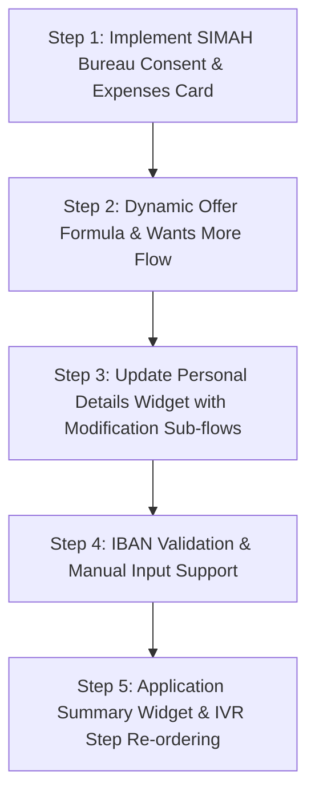

# Process Flow Gap Analysis & Next Steps

This document compares the business process flow specified in [Mobile app Process flow.xlsx](file:///d:/workflow-agent/AiAgentChat/Mobile%20app%20Process%20flow.xlsx) (sheets *Process Flow*, *Field Requirements*, *Customer Master*, *Formula*, and *IBAN Master*) against the current implementation in the codebase.

---

## 1. Journey Flow: Implemented vs. Pending

The table below outlines the retail loan origination journey steps defined in the Excel document and contrasts them with the current implementation.

| Step # | Process Flow Requirement (Excel) | Current Implementation | Status | Gaps / Pending Items |
| :--- | :--- | :--- | :---: | :--- |
| **[1]** | Customer enters Mobile Number (Live/Fallback OTP) | Implemented via the login page: [page.tsx](file:///d:/workflow-agent/AiAgentChat/frontend/src/app/login/page.tsx). | ✅ | *None* |
| **[2]** | Customer enters National ID | Implemented in [router.py](file:///d:/workflow-agent/AiAgentChat/agent/extractors/router.py) (`identity/awaiting_id` sub-step). | ✅ | *None* |
| **[3.1]** | System pushes Nafath notification | Implemented in [router.py](file:///d:/workflow-agent/AiAgentChat/agent/extractors/router.py) (`identity/nafath_pending` sub-step). | ✅ | *None* |
| **[3.2]** | Customer approves Nafath request (5s loader) | Implemented via the [LoadingWidget.tsx](file:///d:/workflow-agent/AiAgentChat/frontend/src/components/widgets/LoadingWidget.tsx) in `identity/loading`. | ✅ | *None* |
| **[4]** | Dedupe runs to classify customer as **ETB** or **NTB** | Implemented via `identity/dedupe_check` with test IDs `1046403930` (ETB) and `1046403940` (NTB). | ✅ | *None* |
| **[5]** | **NTB:** Explain 5-step journey **ETB:** Populate Pre-Approved offer | **NTB:** Implemented ([NTBIntroductionWidget.tsx](file:///d:/workflow-agent/AiAgentChat/frontend/src/components/widgets/NTBIntroductionWidget.tsx)). **ETB:** Immediately transitions to `offer/eligible`. | ✅ | *None* (Routing works, but ETB offers are hardcoded rather than database-driven). |
| **[6]** | **NTB:** Populate personal/employment/income details card & allow modifications | Displayed via [PersonalDetailsWidget.tsx](file:///d:/workflow-agent/AiAgentChat/frontend/src/components/widgets/PersonalDetailsWidget.tsx) in `identity/personal_details`. | ✅ | *None* |
| **[7]** | **NTB:** Ask customer for average monthly expenses across categories | Implemented via [ExpensesWidget.tsx](file:///d:/workflow-agent/AiAgentChat/frontend/src/components/widgets/ExpensesWidget.tsx). | ✅ | *None* |
| **[8]** | **NTB & ETB:** Take customer consent to fetch Bureau records (SIMAH) | Completely skipped in the conversational state machine. | ❌ | **Missing Step:** We must request explicit bureau fetch consent from both customer types before displaying finalized loan details. |
| **[9]** | **NTB:** Run eligibility check / due diligence | Done implicitly under the hood, but skipped in conversation. | ❌ | **Missing Step:** We must simulate/trigger this check after SIMAH consent and before displaying the offer. |
| **[10]** | **NTB:** Show max eligible amount **ETB:** Show pre-approved amount | Implemented via [EligibleOfferWidget.tsx](file:///d:/workflow-agent/AiAgentChat/frontend/src/components/widgets/EligibleOfferWidget.tsx). | ✅ | *None* (UI is in place, but amounts are hardcoded mock values). |
| **[11]** | **NTB & ETB:** Ask customer if maximum amount is okay or if they want more | Completely skipped in conversation. | ❌ | **Missing Step:** If customer requests more, the application must run the "Wants More" (Open Banking / Backoffice) path. |
| **[12]** | **NTB & ETB:** Select desired amount & tenure via slider | Implemented via [OfferSliderWidget.tsx](file:///d:/workflow-agent/AiAgentChat/frontend/src/components/widgets/OfferSliderWidget.tsx). | ✅ | *None* |
| **[13]** | **NTB & ETB:** Confirm selected amount | Implemented via [FinanceSummaryWidget.tsx](file:///d:/workflow-agent/AiAgentChat/frontend/src/components/widgets/FinanceSummaryWidget.tsx). | ✅ | *None* |
| **[15]** | **NTB & ETB:** Initiate Commodity transaction | Implemented via `trade/loading` sub-step. | ✅ | *None* |
| **[16]** | **NTB & ETB:** Generate commodity certificate (with download option) | Renders standard successful verification layout. | ⚠️ | **Missing Download Feature:** The customer should be able to view and download a mock commodity trade certificate. |
| **[17]** | **NTB & ETB:** Generate Contract & Promissory Note | Implemented via [DocumentPreviewWidget.tsx](file:///d:/workflow-agent/AiAgentChat/frontend/src/components/widgets/DocumentPreviewWidget.tsx) in `esign/documents`. | ✅ | *None* |
| **[18]** | **NTB & ETB:** Send documents for e-signing | Implemented via `esign/documents` click-to-sign simulation. | ✅ | *None* |
| **[19]** | **NTB:** Enter/select IBAN **ETB:** Select IBAN from list or enter new | Implemented via [AccountSelectorWidget.tsx](file:///d:/workflow-agent/AiAgentChat/frontend/src/components/widgets/AccountSelectorWidget.tsx). | ⚠️ | **Missing Manual Entry & Choice:** Currently, the screen only lets the user pick from two default IBANs. It does not allow manual IBAN input. |
| **[20]** | **NTB & ETB:** IBAN validation (Populate IBAN, Bank, Beneficiary name) | Handled statically. | ❌ | **Missing Database Lookup:** If the user enters an IBAN manually, the system should look up and validate it against the `IBAN Master` records. |
| **[21]** | **NTB & ETB:** Populate Summary of the application | Completely skipped. | ❌ | **Missing Step:** We must show an application summary before moving to final IVR confirmation. |
| **[22]** | **NTB & ETB:** Get customer consent over IVR call | The codebase includes an IVR trigger widget, but places it in step 4 (`esign/otp_ivr`) rather than pre-disbursement. | ⚠️ | **Incorrect Placement:** The IVR verification must happen *after* IBAN selection & validation, right before disbursement. |
| **[23]** | **NTB & ETB:** Disburse funds | Implemented via [DisbursementWidget.tsx](file:///d:/workflow-agent/AiAgentChat/frontend/src/components/widgets/DisbursementWidget.tsx) in the `done` step. | ✅ | *None* |

---

## 2. Detailed Gap Analysis & Technical Specifications

### A. Details Modification Flow (Step [6] - NTB Only)
> [!IMPORTANT]
> When the NTB customer is shown the personal details card, they must be given the choice: "Confirm & Proceed" or "Modify Details".
If they choose "Modify Details", the system must prompt them to choose which section to modify:
1. **Personal Details:** Highlight modifiable fields (Level of Education, Marital Status, Dependents) and save updates.
2. **Address Details:** Ask whether they want to "Modify Address" or "Add New Address".
3. **Employment Details:** Highlight modifiable fields and prompt them to upload a verification document.
4. **Income Details:** Prompt them to enter an "Updated Income" and choose between:
   - *Option A: Upload Bank Statement* (Simulated file upload).
   - *Option B: Open Banking* (Proceed to Open Banking flow).

### B. Eligibility Formula Calculations (Formula Sheet)
Currently, the eligible amount is mock-calculated. According to the spreadsheet:
- **Maximum Allowed Amount** = `[(Monthly Income × 35%) − Monthly Obligations − (Credit Card Limit × 5%)] * 60`
- **Example Calculation:** For an income of **SAR 35,650**, obligations of **SAR 8,750**, and credit card limit of **SAR 20,000**:
  `((35650 * 0.35) - 8750 - (20000 * 0.05)) * 60 = SAR 163,650`
- **Estimated Eligible Amount (Maximum DBR)** = `[(Monthly Income × 50%) − Monthly Obligations − (Credit Card Limit × 10%)] * Tenure`

We need to implement these mathematical rules in the backend logic when generating offers.

### C. Wants More / Backoffice Routing (Step [11] - NTB & ETB)
If the customer receives their maximum eligible offer but requests a higher amount:
1. **Trigger Open Banking:** Prompt them to link their bank account via Open Banking. Simulate sending an email and show a linking loader widget.
2. **Retrieve Updated Values:** Auto-populate the updated income to **SAR 41,250** and monthly expenses (obligations) to **SAR 8,750**.
3. **Backoffice Workitem Escalation:** Create a backoffice workitem (Step 24 in Excel). Explain to the customer that their request exceeds automatic limits and that a Relationship Manager (RM) from the branch will connect with them.

### D. Manual IBAN Entry & Validation (Step [19] & [20])
If a customer chooses to enter their IBAN manually:
1. Provide a text field for IBAN input.
2. Validate the entered IBAN against the `IBAN Master` database records:
   - `SA0230400197093922590013` -> Alawwal Bank, Abdul Rahman
   - `SA0210000011100003474306` -> National Commercial Bank, Faisal Rahman
   - `SA0220000003031030859941` -> Al Rajhi Bank, Faisal Rahman
3. If it matches, auto-populate the Bank Name and Customer Name on the IBAN verification card.

---

## 3. Next Things to Do (Implementation Strategy)

To bridge these gaps, we should implement the features in the following logical order:

### 📋 Phase 1: Core Flow Restructuring
1. **Add Expenses Step:** Inject `identity/expenses` sub-step after details confirmation. Create an `ExpensesCard` widget for monthly categories.
2. **Add SIMAH Consent Step:** Inject `identity/bureau_consent` sub-step before moving to the offer step. Require a yes/no consent from the customer.
3. **Integrate Dynamic Calculations:** Replace hardcoded `350,000` offer limits in [router.py](file:///d:/workflow-agent/AiAgentChat/agent/extractors/router.py) with calculations derived from the customer's actual monthly income, obligations, and credit card limit.

### 📋 Phase 2: Widget & Feature Upgrades
1. **Interactive Details Modification:** Rewrite `PersonalDetailsWidget` to allow section editing. Introduce file upload fields for employment verification and bank statement.
2. **Open Banking Simulator:** Create a loader for the Open Banking email confirmation process. Apply the updated values (Income: **41,250**, Expenses: **8,750**) upon success.
3. **Backoffice Escalation:** Create an `escalated` session endpoint that formats backoffice workitems when a customer requests more than their eligible limit.
4. **Commodity Certificate:** Design a simple downloadable mock PDF layout/link for the Murabaha commodity trade certificate.
5. **Manual IBAN Input & Lookup:** Update the `AccountSelectorWidget` to support manual keyboard entry and query mock database records.
6. **Application Summary Screen:** Design a widget displaying all captured fields (income, expenses, selected offer terms, bank details) for a final review.
7. **Reorder IVR Consent:** Shift the IVR widget verification logic from the digital signature step to the post-summary phase (just before disbursement).
